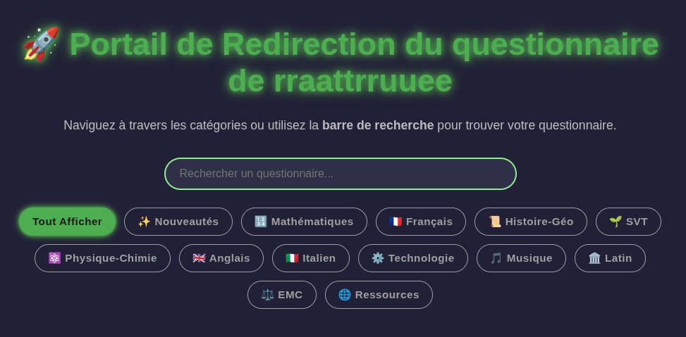
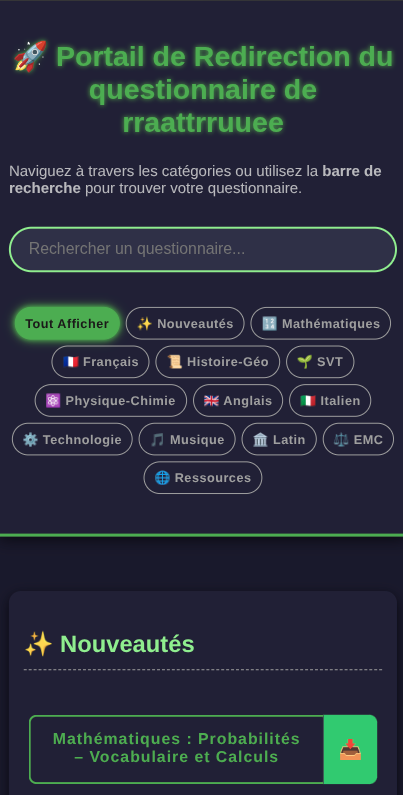
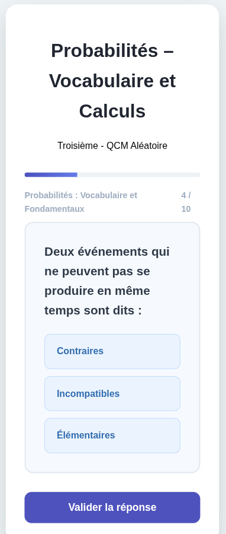

# 🎓 Portail de Questionnaires Interactifs (Niveau 3ème)

[](https://rraattrruuee.github.io/questionnaire-fr--niveaux-3-me/)
[]()

Bienvenue sur le portail des questionnaires interactifs conçus spécifiquement pour le programme de **3ème**.
Boostez vos révisions pour le Brevet avec des outils modernes, rapides et accessibles hors-ligne !

## 📸 Aperçu de l'interface

|           Accueil (Desktop)           |           Interface Mobile            |          Mode Questionnaire           |
| :-----------------------------------: | :-----------------------------------: | :-----------------------------------: |
|  |  |  |
|       _Sélection par matières_        |       _Accès rapide nouveautés_       |           _QCM interactif_            |

---

## 🚀 Démarrage Rapide

Accédez instantanément aux révisions sans installation, ou installez-le comme une application sur votre téléphone ou ordinateur (Kubuntu, Windows, Android).

➡️ **[ACCÉDER AU PORTAIL DES QUESTIONNAIRES](https://rraattrruuee.github.io/questionnaire-fr--niveaux-3-me/)** ⬅️

---

## 🎯 Points Forts du Projet

- ✅ **Révision Efficace :** Concentrez-vous sur les notions essentielles du brevet.
- 🧠 **Format Interactif :** QCM avec correction immédiate et explications détaillées.
- 📶 **Mode Offline (PWA) :** Une fois ouvert, le portail fonctionne même sans connexion internet.
- 📱 **Multi-plateforme :** Optimisé pour les écrans tactiles et les ordinateurs.

---

## 🛠 Contribuer au Projet

Vous avez trouvé une erreur ? Une question manque à l'appel ? Votre aide est précieuse !

### 📝 Signaler un problème (Issue)

1. Rendez-vous sur l'onglet **[Issues](https://github.com/rraattrruuee/questionnaire-fr--niveaux-3-me/issues)**.
2. Cliquez sur **"New issue"**.
3. Utilisez un titre clair : `[ERREUR] SVT - Question sur la génétique`.
4. Décrivez l'erreur et la correction attendue.

---

## ⚙️ Guide Technique : Ajouter des Questions

Le projet utilise le format JSON pour stocker les questions.

### 1. Structure Standard

Pour les matières générales (Français, SVT, EMC...) :

```json
{
  "q": "Titre de la question",
  "answers": ["Choix A", "Choix B", "Choix C"],
  "correct": "Choix B"
}
```

### 2. Format Mathématique (Spécial)

Pour les mathématiques, nous utilisons un rendu HTML spécifique pour les fractions et les puissances.

**Consigne pour IA (ChatGPT/Claude) :**

> "Génère-moi un tableau JSON pour mon application de maths.
>
> - Pas de LaTeX (interdit).
> - Fractions : `<div class='math-frac'><span class='math-num'>NUM</span><span class='math-den'>DEN</span></div>`
> - Puissances : `x<sup>2</sup>`
> - Sujet : [TON SUJET ICI]"

---

### 🛠 Intégration du code

1. Copiez le JSON généré.
2. Ouvrez `revision-maths.html` ou le fichier correspondant.
3. Cherchez `const db = [ ...`.
4. Ajoutez votre bloc à la suite de la liste.

---

> Ce projet est maintenu avec passion par **rraattrruuee**. Bonne révision et plein de succès pour le Brevet ! 🍀
